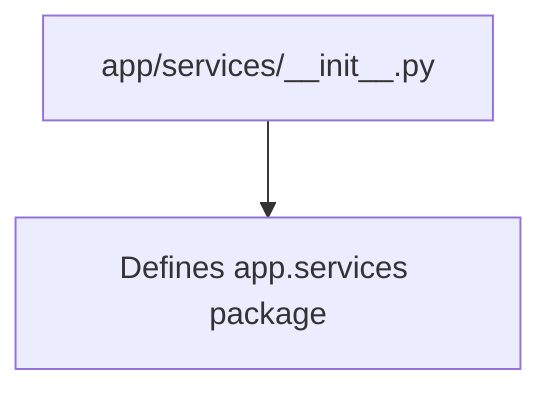

# __init__.py Documentation

## Overview
The `__init__.py` file in the `app/services` package marks the directory as a Python package. It may also be used to initialize package-level variables or import submodules for easier access.

In this project, the `__init__.py` file is currently minimal and does not contain any code or initialization logic.

## Purpose
- Defines `app.services` as a Python package.
- Enables importing modules from `app.services`.

## Diagram

## Usage
No direct usage; serves as package initializer.

---

This documentation provides a brief overview of the `__init__.py` file in the `app/services` package.
