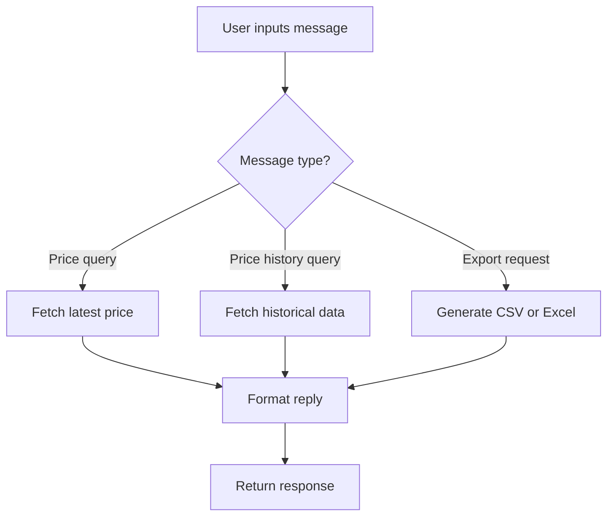
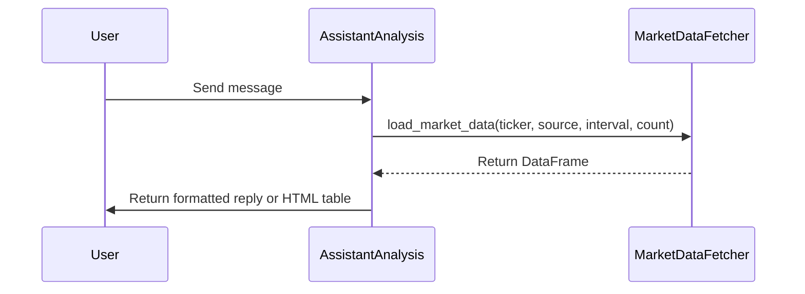

# assistant_analysis.py Documentation

## Overview
The `assistant_analysis.py` module provides functionality to analyze user messages related to financial market data queries. It supports fetching the latest stock prices and historical price data, formatting the results for display, and exporting data in CSV or Excel formats.

---

## Functions

### analyze_message_with_price_history_preserved(message: str) -> dict
Analyzes a user message to provide market data responses while preserving price history functionality for future use.

- **Input:**  
  - `message` (str): The user input message containing queries about stock prices or price history.

- **Process:**  
  - Parses the message to detect queries for latest price or price history.
  - Fetches market data using `load_market_data` from `market_data_fetcher`.
  - Formats data as HTML tables for display.
  - Supports exporting data as CSV or Excel files encoded in base64 with download links.
  - Handles errors gracefully and returns informative replies.

- **Output:**  
  - A dictionary containing keys such as `reply` (text response) or `reply_html` (HTML formatted table and download link).

---

### analyze_message(message: str) -> dict
Analyzes a user message and returns a chatbot reply related to market data queries.

- **Input:**  
  - `message` (str): The user input message.

- **Process:**  
  - Similar to `analyze_message_with_price_history_preserved`, parses and processes price and price history queries.
  - Fetches and formats market data.
  - Handles export requests.
  - Returns appropriate responses or error messages.

- **Output:**  
  - A dictionary with keys `reply` and optionally `reply_html`.

---

## Detailed Flowchart



---

## Sequence Diagram



---

## Code Snippet Example

```python
def analyze_message(message: str) -> dict:
    if not message:
        return {"reply": "Please enter a message to analyze."}
    # Parse message and fetch data...
```

---

## Notes
- The module relies on `load_market_data` from `market_data_fetcher` to retrieve market data.
- Error handling ensures user-friendly messages on data fetch failures.
- Export functionality encodes files in base64 for browser download links.
- HTML tables are styled with CSS class `price-history-table` for consistent UI.

---

This documentation provides a comprehensive understanding of the `assistant_analysis.py` module, its functions, and data flow for market data query handling.
