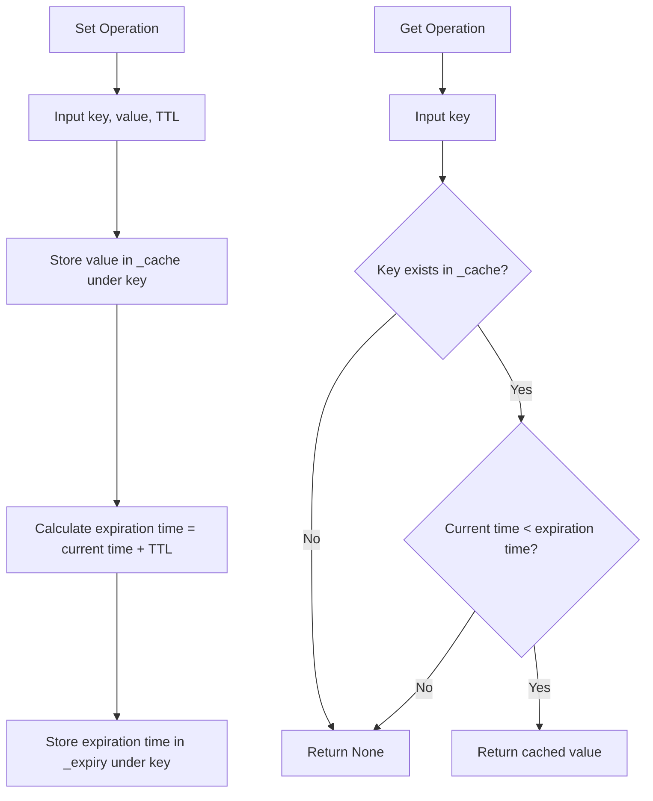

# cache_manager.py Documentation

## Overview
The `cache_manager.py` module provides a simple in-memory cache manager with time-to-live (TTL) expiration support. It allows storing key-value pairs with an expiration time, enabling efficient caching of data to improve performance and reduce redundant computations or data fetches.

---

## CacheManager Class

### Description
The `CacheManager` class manages an internal cache dictionary and an expiry dictionary to track expiration times for each cached key. It supports setting values with a TTL and retrieving values only if they have not expired.

### Attributes
- `_cache` (dict): Stores cached key-value pairs.
- `_expiry` (dict): Stores expiration timestamps (epoch time) for each key.

### Methods

#### `__init__()`
Initializes the cache and expiry dictionaries as empty.

#### `get(key: str) -> Optional[Any]`
Retrieves the cached value for the given key if it exists and has not expired.

- **Parameters:**
  - `key` (str): The key to look up in the cache.

- **Returns:**
  - The cached value if present and valid; otherwise, `None`.
  
- **Pseudocode:**
  ```
  if key in cache and expiry[key] > current_time:
      return cache[key]
  else:
      return None
  ```

#### `set(key: str, value: Any, ttl: int = 300) -> None`
Sets a value in the cache with an optional TTL (default 5 minutes).

- **Parameters:**
  - `key` (str): The key under which to store the value.
  - `value` (Any): The value to cache.
  - `ttl` (int, optional): Time-to-live in seconds.

- **Pseudocode:**
  ```
  cache[key] = value
  expiry[key] = current_time + ttl
  ```

---

## Flowchart Description



---

This documentation provides a detailed understanding of the cache manager's functionality and usage.
