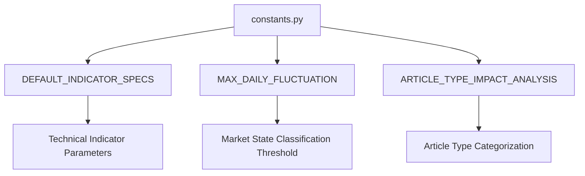

# constants.py Documentation

## Overview
The `constants.py` module defines constant values and default specifications used throughout the application, particularly for technical indicators and market state classification. These constants provide standardized parameters and values to ensure consistency across the system.

---

## Constants

### DEFAULT_INDICATOR_SPECS
A dictionary defining default parameter specifications for various technical indicators used in market analysis.

- **Type:** `Dict[str, Dict[str, Any]]`
- **Description:** Maps indicator names to their default parameter windows or settings.
- **Examples:**
  - `"SMA"`: Simple Moving Average with windows `[10, 20, 50]`
  - `"MACD"`: Moving Average Convergence Divergence with fast, slow, and signal windows
  - Indicators like `"OnBalanceVolumeIndicator"` have no parameters.

### MAX_DAILY_FLUCTUATION
A float constant representing the maximum allowed daily price fluctuation percentage used in market state classification.

- **Type:** `float`
- **Value:** `0.1` (i.e., 0.1%)

### ARTICLE_TYPE_IMPACT_ANALYSIS
A string constant representing a new article type for impact analysis.

- **Type:** `str`
- **Value:** `"impact_analysis"`

---

## Usage Context
These constants are used throughout the backend services to configure indicator calculations, enforce market state classification rules, and categorize article types for analysis.

---

## Diagram

---

This documentation provides a clear understanding of the constants and their roles in the system.
