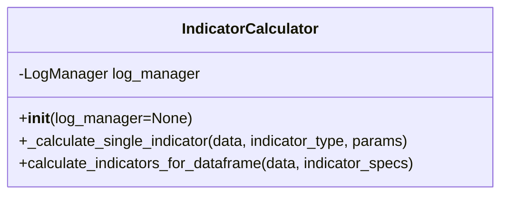

# indicator_calculator.py Documentation

## Overview
The `indicator_calculator.py` module provides the `IndicatorCalculator` class, which calculates a variety of technical indicators for market data. It leverages the 'ta' library for standard indicators and includes custom logic for handling multiple parameter sets and detailed logging.

---

## IndicatorCalculator Class

### Description
The `IndicatorCalculator` class encapsulates the logic for computing common technical analysis indicators such as SMA, EMA, RSI, MACD, Bollinger Bands, ADX, CCI, and others. It supports calculating multiple instances of the same indicator with different parameters and integrates with a LogManager for detailed operation and error logging.

### Initialization
- Accepts an optional `LogManager` instance for logging.
- Logs initialization info.

### Methods

#### `_calculate_single_indicator(data, indicator_type, params)`
Calculates a single technical indicator for the given market data and parameters.

- **Parameters:**
  - `data` (pd.DataFrame): Market data containing columns like 'close', 'high', 'low', 'volume'.
  - `indicator_type` (str): The indicator type to calculate (e.g., 'SMA', 'RSI').
  - `params` (dict): Parameters specific to the indicator, can be single values or lists.

- **Returns:**
  - A Pandas Series or DataFrame with the calculated indicator(s), or None if calculation fails.

- **Functionality:**
  - Validates input data and required columns.
  - Handles list parameters by calculating multiple instances.
  - Uses 'ta' library indicator classes for calculations.
  - Logs warnings and errors appropriately.

#### `calculate_indicators_for_dataframe(data, indicator_specs)`
Calculates multiple specified indicators and appends them to the input DataFrame.

- **Parameters:**
  - `data` (pd.DataFrame): Market data to which indicators will be added.
  - `indicator_specs` (list of dict): List of indicator specifications with names and parameters.

- **Returns:**
  - A new DataFrame with original data and appended calculated indicators.

- **Functionality:**
  - Iterates over indicator specifications.
  - Calls `_calculate_single_indicator` for each.
  - Ensures unique column names.
  - Logs progress and errors.

---

## Pseudocode

### _calculate_single_indicator
```
if data is empty:
    log warning and return None

check required columns exist in data

initialize empty results DataFrame

try:
    for each parameter set in params:
        calculate indicator using 'ta' library
        add results to results DataFrame
    if results empty:
        log warning and return None
    if single column:
        return Series
    else:
        return DataFrame
except Exception as e:
    log error and return None
```

### calculate_indicators_for_dataframe
```
if data is empty:
    log warning and return empty DataFrame

copy input data

for each indicator spec in indicator_specs:
    extract name and params
    generate unique name prefix
    calculate indicator(s) using _calculate_single_indicator
    if result is Series or DataFrame:
        add to calculated indicators dict
    else:
        log error

if any indicators calculated:
    create DataFrame from calculated indicators
    append new columns to data copy
else:
    log warning

return data with indicators
```

---

## Diagrams



```mermaid
flowchart TD
    A[Input market data and indicator specs] --> B[For each indicator spec]
    B --> C[Validate parameters]
    C --> D[Calculate indicator(s) using _calculate_single_indicator]
    D --> E[Collect results]
    E --> F[Append all indicators to original data]
    F --> G[Return augmented DataFrame]
```

---

This documentation provides a detailed understanding of the indicator calculation process and usage.
