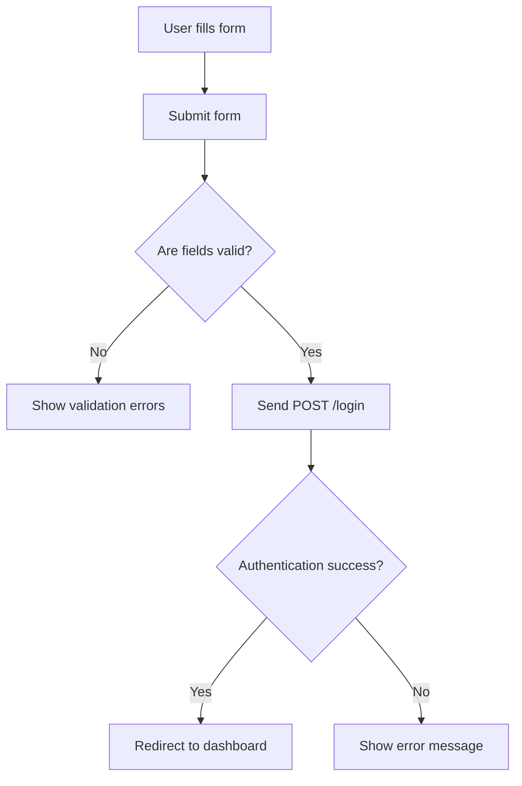

# Login Page Documentation

## Overview
The Login page provides a user interface for users to authenticate into the Gravity Analysis platform. It includes a login form with username/email and password fields, a "Remember Me" option, and links for password reset and registration. The page also displays a branded image alongside the form.

---

## Input
- User inputs via the login form:
  - `username` (str): Username or email address.
  - `password` (str): User password.
  - `remember_me` (bool, optional): Checkbox to remember the user session.
- Optional `error` message passed from backend to display login errors.

---

## Process
- Renders a header with logo, title, and slogan.
- Displays a login form with validation for required fields.
- Shows error messages conditionally based on backend validation results.
- Provides links for password reset and registration.
- Displays a login-related image beside the form.
- Submits form data via POST to `/login` endpoint.

---

## Output
- Rendered HTML page with styled login form and error messages.
- On form submission, backend processes authentication and returns success or error.

---

## Feedback
- Displays error messages for missing fields or invalid credentials.
- Visual feedback on form validation and error display.
- Console logs not applicable.

---

## Page Structure
- Header: Logo image, page title, slogan.
- Main:
  - Login form with inputs and buttons.
  - Image section displaying login-related graphic.
- Footer: Copyright notice.

---

## Required Backend APIs
- POST `/login`: Endpoint to authenticate user credentials and manage session.
- GET `/password_reset`: Endpoint for password reset page.
- GET `/register`: Endpoint for user registration page.

---

## Diagrams

### UML Component Diagram

```mermaid
componentDiagram
    component LoginPage {
        [Header]
        [LoginForm]
        [ErrorMessages]
        [ImageSection]
        [Footer]
    }
    component LoginForm {
        [UsernameInput]
        [PasswordInput]
        [RememberMeCheckbox]
        [SubmitButton]
        [PasswordResetLink]
        [RegisterLink]
    }
```

### BPMN Diagram

```mermaid
bpmnDiagram
    startEvent(Start) --> task(Render Header)
    task(Render Header) --> task(Render Login Form)
    task(Render Login Form) --> task(Handle Form Submission)
    task(Handle Form Submission) --> exclusiveGateway{Valid Credentials?}
    exclusiveGateway -- Yes --> endEvent(Login Success)
    exclusiveGateway -- No --> task(Display Error Message)
    task(Display Error Message) --> endEvent(Login Failure)
```

### Flowchart: Login Form Submission



---

This documentation provides a detailed understanding of the Login page structure, behavior, and backend dependencies.
