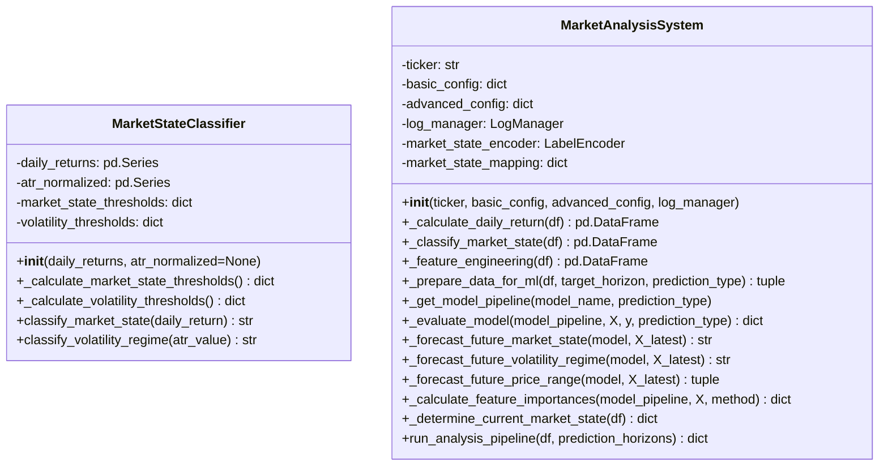
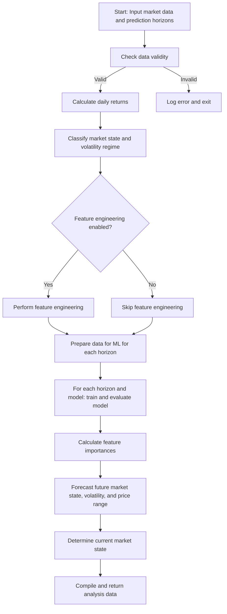

# market_analysis_system.py Documentation

## Overview
The `market_analysis_system.py` module provides classes and methods for comprehensive market data analysis, feature engineering, machine learning model training, and prediction. It includes dynamic market state classification and volatility regime classification, as well as a full analysis pipeline supporting multiple prediction horizons and models.

---

## Classes

### MarketStateClassifier

**Input:**
- `daily_returns` (pd.Series): Series of daily return values.
- `atr_normalized` (Optional[pd.Series]): Series of normalized Average True Range values (optional).

**Process:**
- Calculates dynamic thresholds for market states and volatility regimes based on statistical properties of inputs.
- Classifies individual daily returns and ATR values into market states and volatility regimes.

**Output:**
- Market state classification strings (e.g., "BULLISH", "BEARISH").
- Volatility regime classification strings (e.g., "high", "low").

**Feedback:**
- None (pure classification logic).

**Methods:**
- `_calculate_market_state_thresholds()`: Calculates thresholds for market states.
- `_calculate_volatility_thresholds()`: Calculates thresholds for volatility regimes.
- `classify_market_state(daily_return)`: Classifies a daily return into a market state.
- `classify_volatility_regime(atr_value)`: Classifies normalized ATR into a volatility regime.

---

### MarketAnalysisSystem

**Input:**
- `ticker` (str): Stock ticker symbol.
- `basic_config` (Dict[str, Any]): Basic configuration settings.
- `advanced_config` (Dict[str, Any]): Advanced configuration settings.
- `log_manager` (LogManager): Logger instance.

**Process:**
- Calculates daily returns.
- Classifies market states and volatility regimes.
- Performs feature engineering based on configuration.
- Prepares data for machine learning.
- Trains and evaluates models using cross-validation and hyperparameter tuning.
- Forecasts future market states, volatility regimes, and price ranges.
- Calculates feature importances.
- Determines current market state.

**Output:**
- Dictionary containing analysis data including model performance, feature importances, forecasts, and market state info.

**Feedback:**
- Logs detailed information and warnings via `log_manager`.

**Key Methods:**
- `_calculate_daily_return(df)`: Calculates daily returns.
- `_classify_market_state(df)`: Classifies market states and volatility regimes.
- `_feature_engineering(df)`: Performs feature engineering based on config.
- `_prepare_data_for_ml(df, target_horizon, prediction_type)`: Prepares data for ML.
- `_get_model_pipeline(model_name, prediction_type)`: Returns ML pipeline.
- `_evaluate_model(model_pipeline, X, y, prediction_type)`: Evaluates model performance.
- `_forecast_future_market_state(model, X_latest)`: Forecasts future market state.
- `_forecast_future_volatility_regime(model, X_latest)`: Forecasts future volatility regime.
- `_forecast_future_price_range(model, X_latest)`: Forecasts future price range.
- `_calculate_feature_importances(model_pipeline, X, method)`: Calculates feature importances.
- `_determine_current_market_state(df)`: Determines current market state.
- `run_analysis_pipeline(df, prediction_horizons)`: Runs full analysis pipeline.

---

## Usage Example

```python
from app.services.market_analysis_system import MarketStateClassifier, MarketAnalysisSystem
from app.services.log_manager import LogManager
import pandas as pd

log_manager = LogManager()
daily_returns = pd.Series([...])
atr_normalized = pd.Series([...])

# MarketStateClassifier usage
msc = MarketStateClassifier(daily_returns, atr_normalized)
state = msc.classify_market_state(0.01)
volatility = msc.classify_volatility_regime(0.02)

# MarketAnalysisSystem usage
basic_config = {...}
advanced_config = {...}
mas = MarketAnalysisSystem("AAPL", basic_config, advanced_config, log_manager)
df = pd.DataFrame(...)  # Market data
prediction_horizons = [1, 5, 10]
results = mas.run_analysis_pipeline(df, prediction_horizons)
print(results)
```

---

## Diagrams

### Class Diagram



### Flowchart: run_analysis_pipeline



---

This documentation provides a detailed understanding of the market analysis system and its usage.
