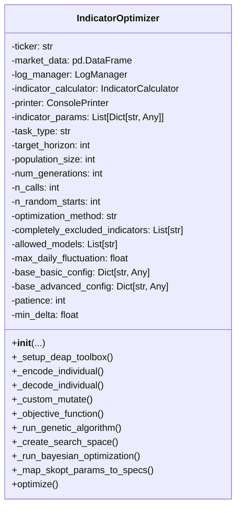

# optimization_engine.py Documentation

## Overview
The `optimization_engine.py` module provides the `IndicatorOptimizer` class, which optimizes technical indicator parameters to improve market state prediction models. It supports both Genetic Algorithm (GA) and Bayesian Optimization (BO) methods, with early stopping and caching of evaluated configurations.

---

## Classes

### IndicatorOptimizer
Optimizes parameters of technical indicators using GA or BO to enhance market analysis performance.

- **Initialization Parameters:**
  - `ticker`: Stock ticker symbol.
  - `market_data`: Market data DataFrame.
  - `log_manager`: LogManager instance.
  - `indicator_calculator`: IndicatorCalculator instance.
  - `printer`: ConsolePrinter instance.
  - `indicator_params`: List of indicator instances with parameter choices.
  - `task_type`: Optimization task type ('classification' supported).
  - `target_horizon`: Prediction horizon.
  - `population_size`, `num_generations`: GA parameters.
  - `n_calls`, `n_random_starts`: BO parameters.
  - `optimization_method`: 'GA', 'Bayesian', or 'Both'.
  - `completely_excluded_indicators`: Indicators to exclude.
  - `allowed_models`: Models allowed for evaluation.
  - `max_daily_fluctuation`: Threshold for market state.
  - `basic_config`, `advanced_config`: Configs for MarketAnalysisSystem.
  - `patience`, `min_delta`: Early stopping parameters.

- **Key Methods:**
  - `_setup_deap_toolbox()`: Sets up GA operators.
  - `_encode_individual()`, `_decode_individual()`: Encode/decode parameter sets.
  - `_custom_mutate()`: Custom mutation for GA.
  - `_objective_function()`: Fitness evaluation function.
  - `_run_genetic_algorithm()`: Runs GA optimization.
  - `_create_search_space()`: Creates BO search space.
  - `_run_bayesian_optimization()`: Runs BO optimization.
  - `_map_skopt_params_to_specs()`: Maps BO results to specs.
  - `optimize()`: Runs selected optimization methods and returns results.

---

## Usage Example

```python
from app.services.optimization_engine import IndicatorOptimizer
from app.services.log_manager import LogManager
from app.services.indicator_calculator import IndicatorCalculator
from app.services.market_analysis_system import MarketAnalysisSystem
from app.services.cache_manager import CacheManager
from app.services.log_manager import ConsolePrinter

log_manager = LogManager()
printer = ConsolePrinter()
indicator_calculator = IndicatorCalculator(log_manager)
market_data = ...  # Load market data DataFrame
indicator_params = [
    {"name": "SMA", "window_choices": [10, 20, 50]},
    {"name": "RSI", "window_choices": [14, 21]}
]
basic_config = {...}
advanced_config = {...}

optimizer = IndicatorOptimizer(
    ticker="AAPL",
    market_data=market_data,
    log_manager=log_manager,
    indicator_calculator=indicator_calculator,
    printer=printer,
    indicator_params=indicator_params,
    task_type='classification',
    target_horizon=1,
    population_size=50,
    num_generations=10,
    optimization_method='GA',
    basic_config=basic_config,
    advanced_config=advanced_config
)

results = optimizer.optimize()
print(results)
```

---

## Diagrams

### Class Diagram



### Flowchart: Optimization Process

```mermaid
flowchart TD
    A[Start Optimization] --> B{Optimization Method}
    B -- GA --> C[Run Genetic Algorithm]
    B -- Bayesian --> D[Run Bayesian Optimization]
    B -- Both --> C & D
    C --> E[Evaluate Individuals]
    D --> E
    E --> F[Update Best Fitness and Specs]
    F --> G{Early Stopping?}
    G -- No --> C or D
    G -- Yes --> H[Return Best Specs and Fitness]
```


This documentation provides a detailed understanding of the optimization engine and its usage.
