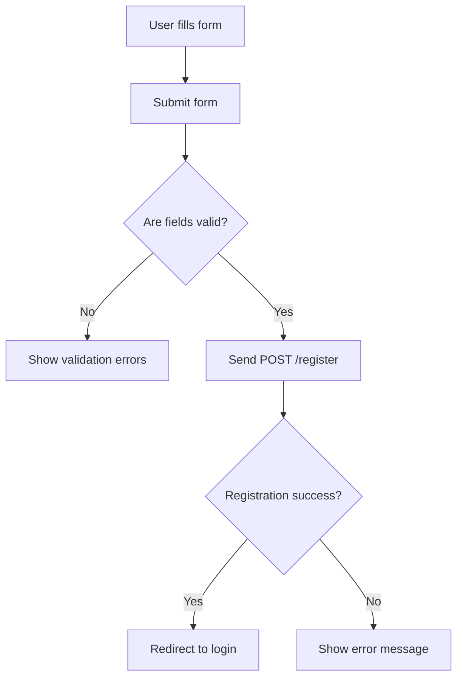

# Register Page Documentation

## Overview
The Register page provides a user interface for new users to create an account on the GravityChats platform. It includes a registration form with fields for username, email, password, and password confirmation. The page also displays a branded image alongside the form.

---

## Input
- User inputs via the registration form:
  - `username` (str): Desired username.
  - `email` (str): User's email address.
  - `password` (str): Password.
  - `confirm_password` (str): Password confirmation.
- Optional `error` message passed from backend to display registration errors.

---

## Process
- Renders a header with logo, title, and slogan.
- Displays a registration form with validation for required fields.
- Shows error messages conditionally based on backend validation results.
- Provides a link to the login page for existing users.
- Displays a login-related image beside the form.
- Submits form data via POST to `/register` endpoint.

---

## Output
- Rendered HTML page with styled registration form and error messages.
- On form submission, backend processes registration and returns success or error.

---

## Feedback
- Displays error messages for validation failures or registration issues.
- Visual feedback on form validation and error display.
- Console logs not applicable.

---

## Page Structure
- Header: Logo image, page title, slogan.
- Main:
  - Registration form with inputs and buttons.
  - Image section displaying login-related graphic.
- Footer: Copyright notice.

---

## Required Backend APIs
- POST `/register`: Endpoint to create a new user account.
- GET `/login`: Endpoint for user login page.

---

## Diagrams

### UML Component Diagram

```mermaid
componentDiagram
    component RegisterPage {
        [Header]
        [RegistrationForm]
        [ErrorMessages]
        [ImageSection]
        [Footer]
    }
    component RegistrationForm {
        [UsernameInput]
        [EmailInput]
        [PasswordInput]
        [ConfirmPasswordInput]
        [SubmitButton]
        [LoginLink]
    }
```

### BPMN Diagram

```mermaid
bpmnDiagram
    startEvent(Start) --> task(Render Header)
    task(Render Header) --> task(Render Registration Form)
    task(Render Registration Form) --> task(Handle Form Submission)
    task(Handle Form Submission) --> exclusiveGateway{Valid Input?}
    exclusiveGateway -- Yes --> endEvent(Registration Success)
    exclusiveGateway -- No --> task(Display Error Message)
    task(Display Error Message) --> endEvent(Registration Failure)
```

### Flowchart: Registration Form Submission



---

This documentation provides a detailed understanding of the Register page structure, behavior, and backend dependencies.
