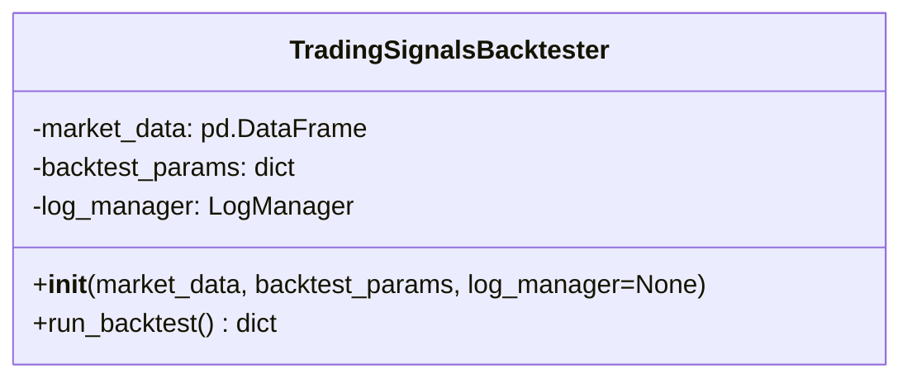

# trading_signals.py Documentation

## Overview
The `trading_signals.py` module provides the `TradingSignalsBacktester` class, which is designed to perform backtesting of trading strategies on market data. It integrates with the `LogManager` for logging and currently contains a placeholder implementation for backtest logic.

---

## TradingSignalsBacktester Class

### Description
The `TradingSignalsBacktester` class manages the backtesting process for trading signals based on provided market data and backtest parameters.

### Initialization
- **Parameters:**
  - `market_data` (pd.DataFrame): Market data on which to run the backtest.
  - `backtest_params` (dict): Parameters configuring the backtest, such as strategy details.
  - `log_manager` (LogManager, optional): Logger instance for logging events.

- Logs initialization information.

### Methods

#### `run_backtest()`
Runs the backtest using the provided parameters.

- **Returns:**
  - A dictionary containing dummy results including:
    - `total_trades`
    - `winning_trades`
    - `losing_trades`
    - `win_rate`
    - `total_profit`
    - `max_drawdown`
    - `strategy`

- **Functionality:**
  - Currently a placeholder that logs the backtest parameters and returns example results.

---

## Usage Example

```python
from app.services.trading_signals import TradingSignalsBacktester
from app.services.log_manager import LogManager
import pandas as pd

log_manager = LogManager()
market_data = pd.DataFrame(...)  # Load or prepare market data
backtest_params = {"strategy": "mean_reversion", "param1": 10}

backtester = TradingSignalsBacktester(market_data, backtest_params, log_manager)
results = backtester.run_backtest()
print(results)
```

---

## Diagram



---

This documentation provides a detailed understanding of the trading signals backtesting module and its usage.
